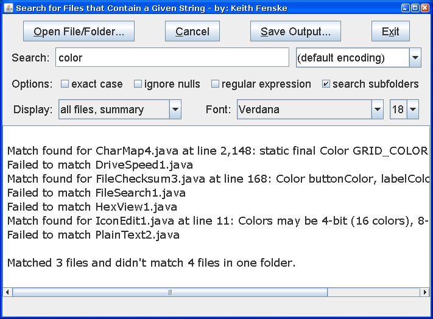

### File Search (Java)

by: Keith Fenske, https://kwfenske.github.io/

FileSearch is a Java 1.4 application to find files that contain (or don't
contain) a given string. The string may be in plain text or it may be a Java
regular expression. Such a trivial search should be part of the operating
system, and in fact, once was. As bigger and more impressive features were
added to Windows, it lost the ability to search files for arbitrary bytes of
text. Windows 98/ME/2000 could find words buried in files with unknown formats;
Windows XP/Vista/7 will search only supported file types. FileSearch does not
expand compressed data and won't find text in Microsoft DOCX, XLSX, or similar
archives.

Download the ZIP file here: https://kwfenske.github.io/file-search-java.zip

Released under the terms and conditions of the Apache License (version 2.0 or
later) and/or the GNU General Public License (GPL, version 2 or later).

